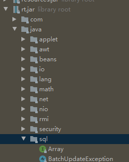

# JDBC
## JDBC 的来历
* Java 编写的时候，开发人员试图写一个兼容所有数据库驱动的 JDBC，但是最后发现太难了，那还算了吧
后来就变成了 Java 提供接口，各个数据库厂商去实现这些接口
* JDBC 全称是 Java Database Connectivity。所以实际上，不光是指我们使用的 mysql 的连接包，那我
学习的重点就是 JDBC，JAVA 中自带的数据库访问类
* JDBC 是标准，是 Java 中的 14 个标准之一，这些标准大部分都存在与 rt.jar 这包里面，
包括 IO 等，都是在这个包里
* 
* 开始学习！